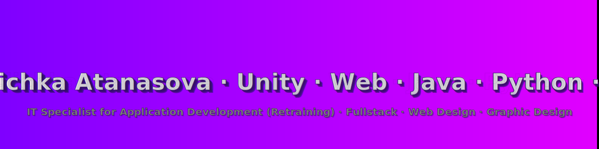
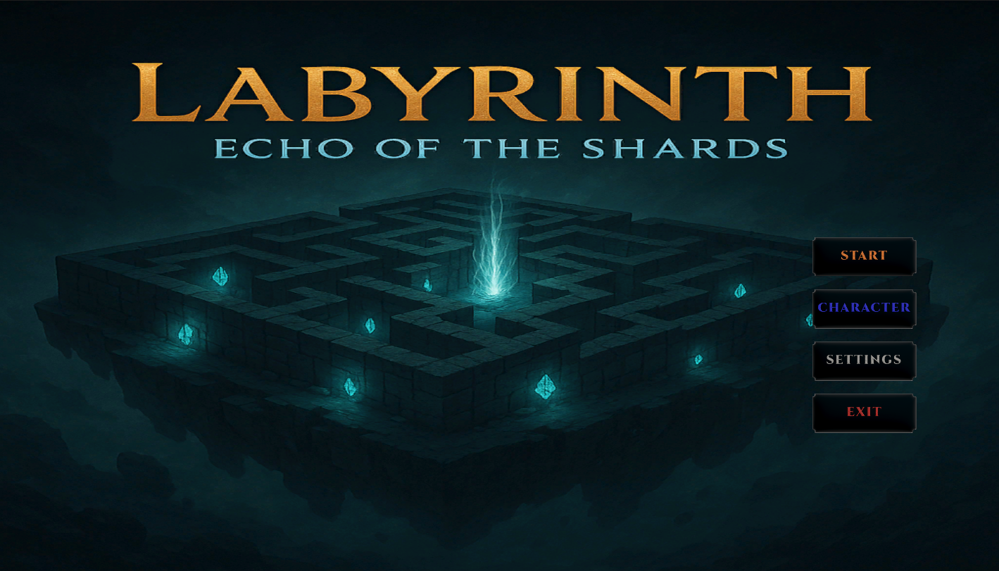
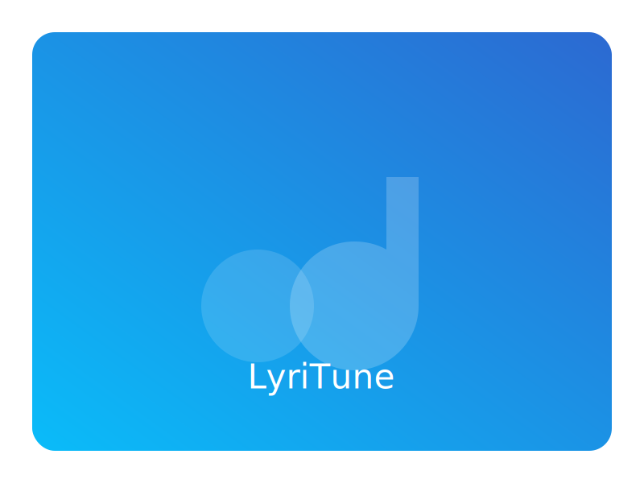
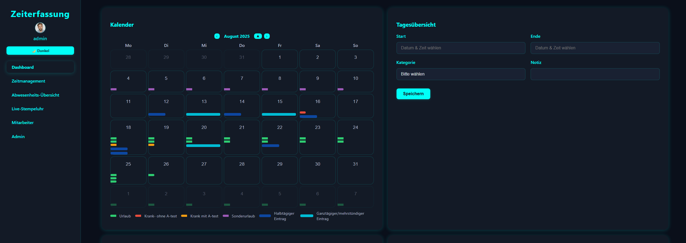
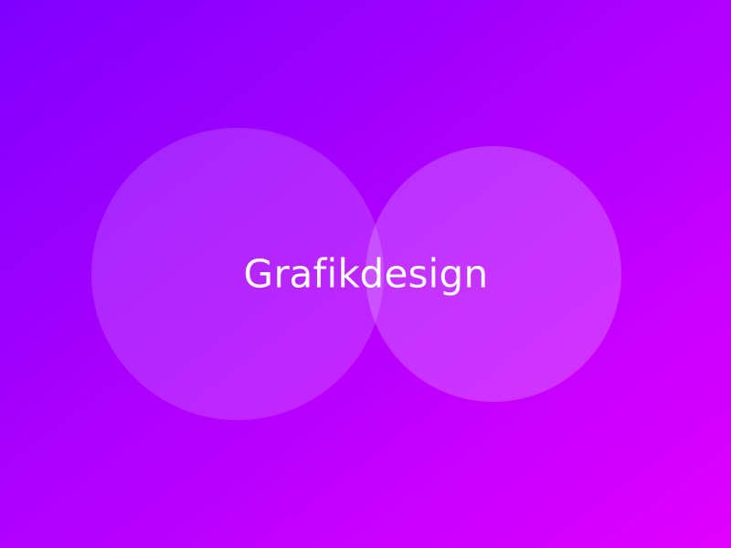
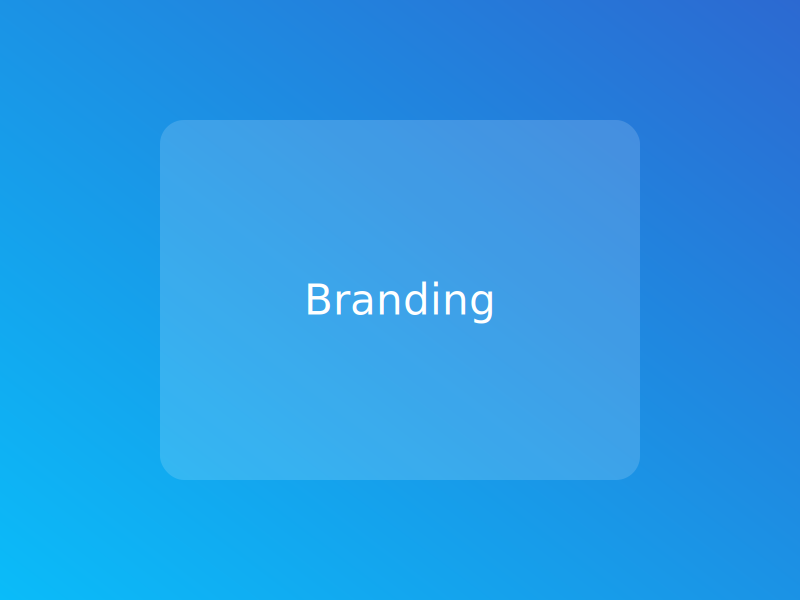
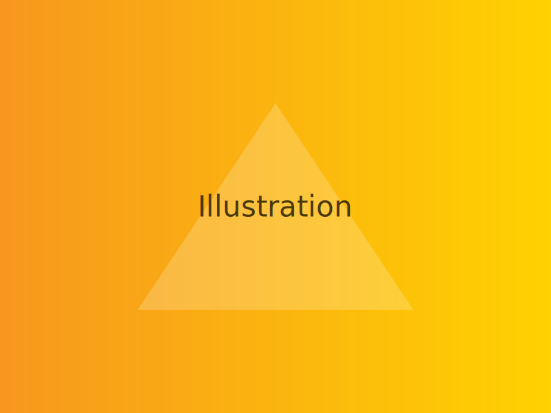
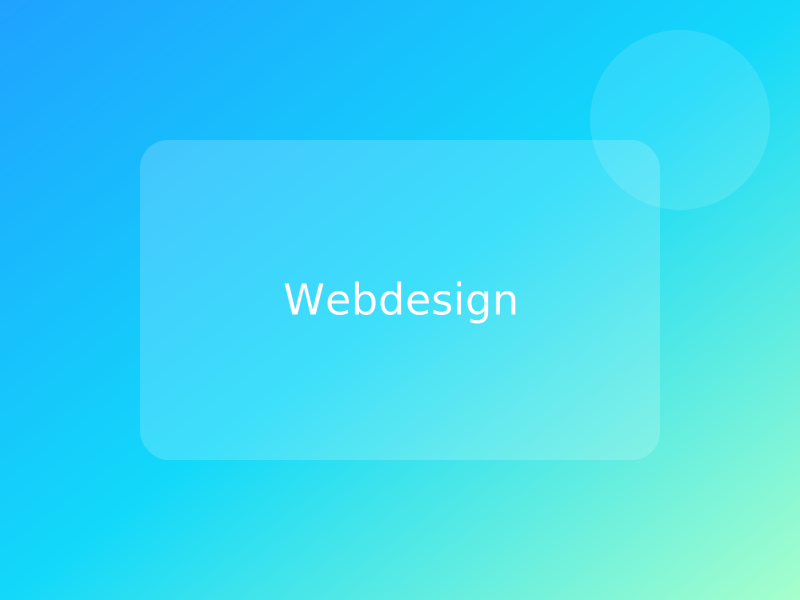
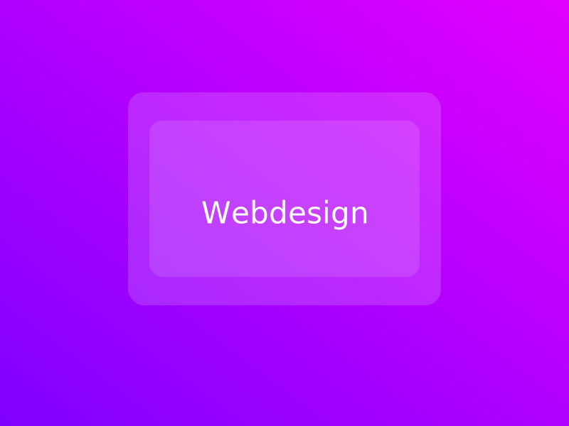
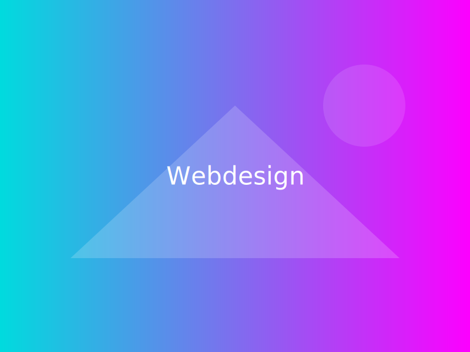

 

🌍 <strong>Available in:</strong>
 <a href="README.md" title="Deutsch">Deutsch</a> |
 <strong>English</strong> |
 <a href="README.bg.md" title="Български">Български</a> |
 <a href="README.ru.md" title="Русский">Русский</a>

IT Specialist AE (Retraining) · Unity/C# · Web (PHP/JS/SQL) · Fullstack · Graphic Design · Stuttgart

## 🧭 Overview
- Retraining: IT Specialist for Application Development (IHK Stuttgart)
- Focus: Unity Game Dev, Web Development (PHP, JavaScript, SQL)
- Languages & Tools: C#, Java, Python, PHP, JavaScript, SQL
- Approach: clean code, test-driven, pragmatic, user-centered

## 📚 Table of Contents

	
<em>Show/hide content</em>

<table style="border-collapse:collapse;margin:0;width:100%;table-layout:auto;">
	<tr>
<td align="left" style="padding:0 8px; vertical-align: top;">
		  <ul style="list-style:none; padding:0; margin:0; white-space:nowrap;">
            <li>🧭 <a href="#overview-en">Overview</a></li>
		    <li>🎯 <a href="#focus-en">Focus Areas</a></li>
		    <li>📸 <a href="#screenshots-en">Screenshots</a></li>
		    <li>🛠️ <a href="#techstack-en">Tech Stack</a></li>
		  </ul>
		</td>
		<td align="left" style="padding:0 8px; vertical-align: top;">
		  <ul style="list-style:none; padding:0; margin:0; white-space:nowrap;">
		    <li>🚀 <a href="#projects-en">Projects (Selection)</a>
		      <ul style="list-style:none; padding-left:0.75rem; margin:6px 0 0 0; white-space:nowrap;">
		        <li>🎮 <a href="#arcadia-en">Project Arcadia</a></li>
		        <li>🎵 <a href="#lyritune-en">LyriTune</a></li>
		        <li>📚 <a href="#skillforge-en">SkillForge</a></li>
		        <li>⏱️ <a href="#zeiterfassung-en">Time Tracking</a></li>
		      </ul>
		    </li>
		  </ul>
		</td>
		<td align="left" style="padding:0 8px; vertical-align: top;">
		  <ul style="list-style:none; padding:0; margin:0; white-space:nowrap;">
		    <li>🎨 <a href="#design-en">Graphic Design – Gallery</a></li>
		    <li>🌐 <a href="#webdesign-en">Web Design – Gallery</a></li>
		    <li>📜 <a href="#certificates-en">Certificates</a></li>
		    <li>📈 <a href="#stats-en">GitHub Stats</a></li>
		    <li>🤝 <a href="#contact-en">Contact</a></li>
		  </ul>
		</td>
	</tr>
 
 </table>

 

## 🎯 Focus Areas

## 🛠️ Tech Stack

<!-- Languages -->

<!-- Frameworks/Engines -->

<!-- Databases -->

<!-- Tools & Practices -->

<!-- Badges removed -->

## 🚀 Projects (Selection)

<table>
    <tr>
  <td width="33%" align="center">
            
             
            <strong><a href="Labyrinth-Echo-of-the-Shards/">🎮 Project Arcadia</a></strong>&nbsp;
             
            Procedural levels, lightweight ECS, focus on game feel. 
            <em>Unity · C# · ScriptableObjects · Prototype/Vertical Slice</em> 
            
            
            
        </td>
  <td width="33%" align="center">
            
             
            <strong><a href="#lyritune-en">🎵 LyriTune (Text‑to‑Song)</a></strong> 
            Turns text into melodies; initial audio generation integrated. 
            <em>Python · Web (API/Frontend) · DSP · MVP in progress</em> 
            
            
        </td>
  <td width="33%" align="center">
            
             
            <strong><a href="https://github.com/Velichka81/learn-platform">📚 SkillForge (IT learning platform)</a></strong> 
            AE focus with quizzes & exercises, clean REST interfaces. 
            <em>PHP · JavaScript · SQL · REST · Backend/DB design</em> 
            
            
            
        </td>
    </tr>
</table>

<table>
    <tr>
  <td width="33%" align="center">
            
             
            <strong><a href="https://github.com/Velichka81/Zeiterfassung">⏱️ Time Tracking</a></strong> 
            Simple, clear tool for recording working hours. 
            <em>PHP · JavaScript · SQL · REST</em> 
            
        </td>
    </tr>
</table>

### 🎮 Project Arcadia

An experimental Unity prototype with procedural levels, a lightweight ECS approach, and a focus on precise game feel. Goal: clean architecture and fast iteration.

➡️ Go to the Unity project: [Labyrinth – Echo of the Shards](Labyrinth-Echo-of-the-Shards/)

### 🎵 LyriTune (Text‑to‑Song)

Converts short texts into simple melodies. Initial DSP building blocks and a small web API are in progress. Demos and source code will be linked here as soon as available.

### 📚 SkillForge (IT learning platform)

Learning platform focused on AE topics: modular concept, quiz engine, and clean REST interfaces. I am currently designing the data model and first endpoints. More info soon.

➡️ Repository: [SkillForge – Learn Platform](https://github.com/Velichka81/learn-platform)

### ⏱️ Time Tracking

A focused time tracking tool with a clear UI. Goal: fast input, clear evaluations, and simple export options.

➡️ Repository: [Time Tracking](https://github.com/Velichka81/Zeiterfassung)

## 📸 Screenshots

Below are a few impressions of the projects. One image per row with a short caption.

_Gameplay_

_UI_

_Dashboard_

_Dashboard_

## 🎨 Graphic Design – Gallery

<table>
    <tr>
  <td align="center">
            
             Graphic Design 1
        </td>
  <td align="center">
            
             Graphic Design 2
        </td>
  <td align="center">
            
             Graphic Design 3
        </td>
    </tr>
  
</table>

> Tip: Also check out the sub‑project in this repo: `Labyrinth-Echo-of-the-Shards/`.

## 🌐 Web Design – Gallery

<table>
    <tr>
  <td align="center">
            
             Web Design 1
        </td>
  <td align="center">
            
             Web Design 2
        </td>
  <td align="center">
            
             Web Design 3
        </td>
    </tr>
  
</table>

## 📜 Certificates

- 🏆 Graphic Designer (2022)
- 🖌️ Computer Graphic Artist (2023)
- 💻 Web Designer (2024)
- 👨‍💻 IT Specialist Application Development (ongoing since 2024, IHK Stuttgart)
- 🐍 Python Basics & SQL (2025)
- 📈 Scrum (2025)

➡️ [View all certificates](https://github.com/Velichka81/certificates)

## 📈 GitHub Stats

## 🤝 Contact

- 📫 Email: velichka811@abv.bg
- 💼 LinkedIn: https://www.linkedin.com/in/velichka-atanasova-32781a227
- 📍 Location: Stuttgart, Germany

