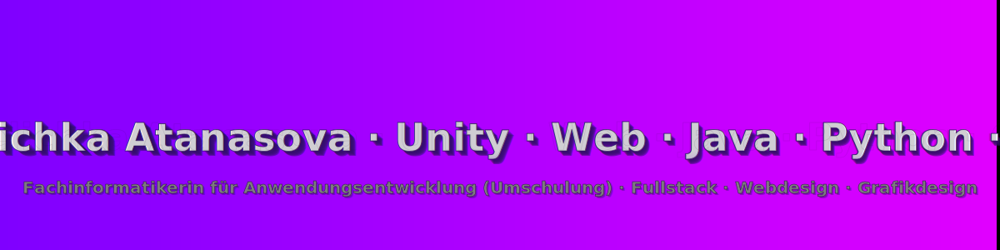
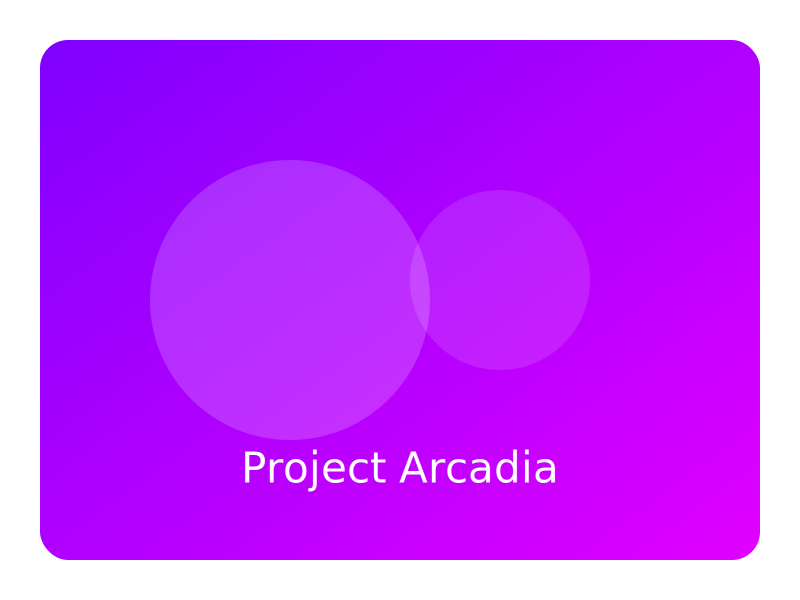
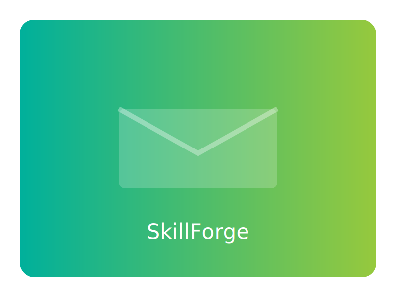

# Willkommen auf meinem GitHub‑Profil 👋

Fachinformatikerin für Anwendungsentwicklung (Umschulung) · Unity Game Development · Web (Frontend/Backend, PHP/JS/SQL) · Fullstack Development · C# · Java · Python · Grafikdesign

---

## 📚 Inhaltsverzeichnis

<table>
	<tr>
		<td align="left" width="50%">

		- 🧭 <a href="#kurzueberblick">Kurzüberblick</a> 
		- 🎯 <a href="#fokus">Fokusbereiche</a> 
		- 🛠️ <a href="#techstack">Tech‑Stack</a> 
		- 🚀 <a href="#projekte">Projekte (Auswahl)</a>
			

				• 🎮 <a href="#arcadia">Project Arcadia</a> 
				• 🎵 <a href="#lyritune">LyriTune</a> 
				• 📚 <a href="#skillforge">SkillForge</a>
			

		</td>
		<td align="left" width="50%">

		- 🎨 <a href="#grafikdesign">Grafikdesign – Galerie</a> 
		- 🌐 <a href="#webdesign">Webdesign – Galerie</a> 
		- 📜 <a href="#zertifikate">Zertifikate</a> 
		- 📈 <a href="#stats">GitHub‑Statistiken</a> 
		- 🤝 <a href="#kontakt">Kontakt</a>

		</td>
	</tr>
  
 </table>

 

## 🧭 Kurzüberblick
- Umschulung: Fachinformatikerin für Anwendungsentwicklung (IHK Stuttgart)
- Schwerpunkte: Unity Game Dev, Webentwicklung (PHP, JavaScript, SQL)
- Sprachen & Tools: C#, Java, Python, PHP, JavaScript, SQL
- Arbeitsweise: sauberer Code, testgetrieben, pragmatisch, nutzerzentriert

## 🎯 Fokusbereiche

## 🛠️ Tech‑Stack

<!-- Programmiersprachen -->

<!-- Frameworks/Engines -->

<!-- Datenbanken -->

<!-- Tools & Praktiken -->

<!-- Badges removed -->

## 🚀 Projekte (Auswahl)

<table>
	<tr>
		<td width="33%" align="center">
			
			 
			<strong>🎮 Project Arcadia</strong>&nbsp;
			 
			Prozedurale Level, leichtgewichtiges ECS, Fokus auf Spielgefühl. 
			<em>Unity · C# · ScriptableObjects · Prototyp/Vertical Slice</em>
		</td>
		<td width="33%" align="center">
			
			 
			<strong>🎵 LyriTune (Text‑to‑Song)</strong> 
			Konvertiert Texte in Melodien; erste Audio‑Generierung integriert. 
			<em>Python · Web (API/Frontend) · DSP · MVP in Arbeit</em>
		</td>
		<td width="33%" align="center">
			
			 
			<strong>📚 SkillForge (IT‑Lernplattform)</strong> 
			AE‑Fokus mit Quiz & Übungen, klare REST‑Schnittstellen. 
			<em>PHP · JavaScript · SQL · REST · Backend/DB‑Design</em>
		</td>
	</tr>
</table>

### 🎮 Project Arcadia

Ein experimenteller Unity‑Prototyp mit prozeduralen Leveln, leichtgewichtigem ECS‑Ansatz und Fokus auf präzises Spielgefühl. Ziel: saubere Architektur und schnelle Iteration.

➡️ Zum Unity‑Projekt: [Labyrinth – Echo of the Shards](Labyrinth-Echo-of-the-Shards/)

### 🎵 LyriTune (Text‑to‑Song)

Konvertiert kurze Texte in einfache Melodien. Erste DSP‑Bausteine und eine kleine Web‑API sind in Arbeit. Demos und Quellcode werden hier verlinkt, sobald verfügbar.

### 📚 SkillForge (IT‑Lernplattform)

Lernplattform mit Themenfokus AE: Modulkonzept, Quiz‑Engine und saubere REST‑Schnittstellen. Aktuell entwerfe ich das Datenmodell und erste Endpunkte. Weitere Infos folgen.

➡️ Zum Repository: [SkillForge – Learn Platform](https://github.com/Velichka81/learn-platform)

## 🎨 Grafikdesign – Galerie

<table>
	<tr>
		<td align="center">
			
			 Grafikdesign 1
		</td>
		<td align="center">
			
			 Grafikdesign 2
		</td>
		<td align="center">
			
			 Grafikdesign 3
		</td>
	</tr>
  
</table>

> Tipp: Sieh dir auch das Unterprojekt im Repo an: `Labyrinth-Echo-of-the-Shards/`.

## 🌐 Webdesign – Galerie

<table>
	<tr>
		<td align="center">
			
			 Webdesign 1
		</td>
		<td align="center">
			
			 Webdesign 2
		</td>
		<td align="center">
			
			 Webdesign 3
		</td>
	</tr>
  
</table>

## 📜 Zertifikate

- 🏆 Grafikdesigner (2022)
- 🖌️ Computergrafiker (2023)
- 💻 Webdesigner (2024)
- 👨‍💻 Fachinformatiker Anwendungsentwicklung (laufend seit 2024, IHK Stuttgart)
- 🐍 Python Grundlagen & SQL (2025)
- 📈 Scrum (2025)

➡️ [Alle Zertifikate ansehen](https://github.com/Velichka81/certificates)

## 📈 GitHub‑Statistiken

## 🤝 Kontakt

- 📫 E‑Mail: velichka811@abv.bg
- 💼 LinkedIn: https://www.linkedin.com/in/velichka-atanasova-32781a227
- 📍 Standort: Stuttgart, Deutschland

