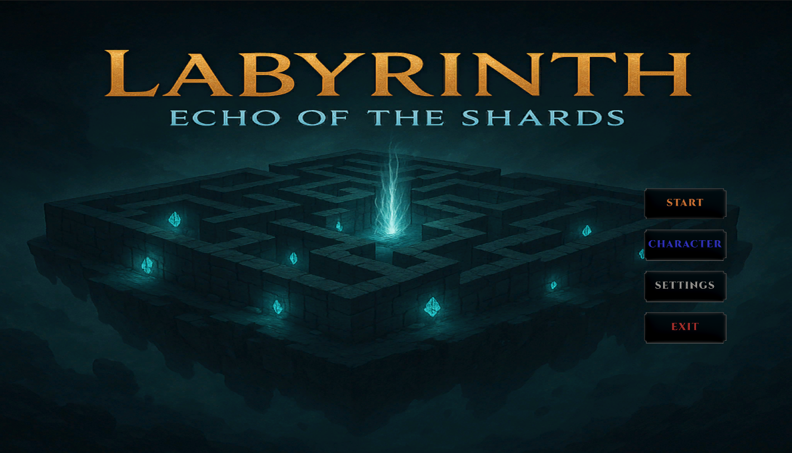
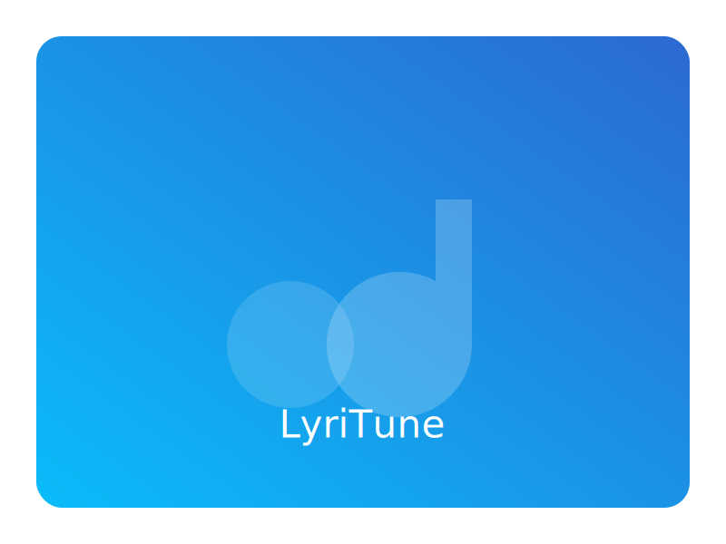
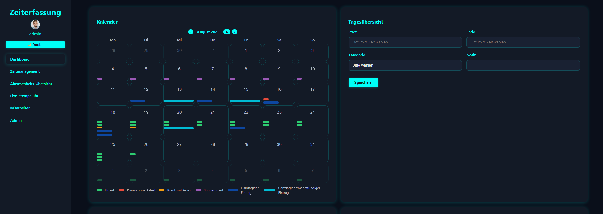
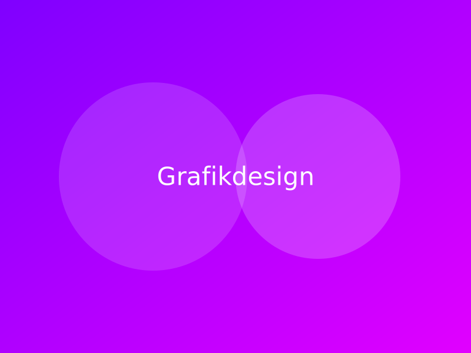

 

🌍 <strong>Verfügbar in:</strong>
&nbsp;&nbsp;|&nbsp;&nbsp;
&nbsp;&nbsp;|&nbsp;&nbsp;
&nbsp;&nbsp;|&nbsp;&nbsp;

---

Fachinformatikerin AE (Umschulung) · Unity/C# · Web (PHP/JS/SQL) · Fullstack · Grafikdesign · Stuttgart

## 🧭 Kurzüberblick
- Umschulung: Fachinformatikerin für Anwendungsentwicklung (IHK Stuttgart)
- Schwerpunkte: Unity Game Dev, Webentwicklung (PHP, JavaScript, SQL)
- Sprachen & Tools: C#, Java, Python, PHP, JavaScript, SQL
- Arbeitsweise: sauberer Code, testgetrieben, pragmatisch, nutzerzentriert

## 📚 Inhaltsverzeichnis

	
<em>Inhalt anzeigen/ausblenden</em>

<table style="border-collapse:collapse;margin:0;width:100%;table-layout:auto;">
	<tr>
		<td align="left" style="padding:0 8px; vertical-align: top;">
		  <ul style="list-style:none; padding:0; margin:0; white-space:nowrap;">
		    <li>🧭 <a href="#kurzueberblick">Kurzüberblick</a></li>
		    <li>🎯 <a href="#schwerpunkte">Schwerpunkte</a></li>
		    <li>📸 <a href="#screenshots">Screenshots</a></li>
		    <li>🛠️ <a href="#techstack">Tech‑Stack</a></li>
		  </ul>
		</td>
		<td align="left" style="padding:0 8px; vertical-align: top;">
		  <ul style="list-style:none; padding:0; margin:0; white-space:nowrap;">
		    <li>🚀 <a href="#projekte">Projekte (Auswahl)</a>
		      <ul style="list-style:none; padding-left:0.75rem; margin:6px 0 0 0; white-space:nowrap;">
		        <li>🎮 <a href="#arcadia">Projekt Arcadia</a></li>
		        <li>🎵 <a href="#lyritune">LyriTune</a></li>
		        <li>📚 <a href="#skillforge">SkillForge</a></li>
		        <li>⏱️ <a href="#zeiterfassung">Zeiterfassung</a></li>
		      </ul>
		    </li>
		  </ul>
		</td>
		<td align="left" style="padding:0 8px; vertical-align: top;">
		  <ul style="list-style:none; padding:0; margin:0; white-space:nowrap;">
		    <li>🎨 <a href="#design">Grafikdesign – Galerie</a></li>
		    <li>🌐 <a href="#webdesign">Webdesign – Galerie</a></li>
		    <li>📜 <a href="#zertifikate">Zertifikate</a></li>
		    <li>📈 <a href="#stats">GitHub‑Statistiken</a></li>
		    <li>🤝 <a href="#kontakt">Kontakt</a></li>
		  </ul>
		</td>
	</tr>
 
 </table>

 

## 🎯 Schwerpunkte

 

 

## 🛠️ Tech‑Stack

<!-- Ordered Tech Stack -->

## 🚀 Projekte (Auswahl)

<table>
    <tr>
    <td width="33%" align="center">
            
             
            <strong><a href="Labyrinth-Echo-of-the-Shards/">🮠Projekt Arcadia</a></strong>&nbsp;
             
            Prozedurale Level, leichtes ECS, Fokus auf Game‑Feel. 
            <em>Unity · C# · ScriptableObjects · Prototyp/Vertical Slice</em> 
            
            
            
        </td>
    <td width="33%" align="center">
            
             
            <strong><a href="#lyritune">🵠LyriTune (Text‑zu‑Melodie)</a></strong> 
            Wandelt Texte in Melodien um; erste Audiogenerierung integriert. 
            <em>Python · Web (API/Frontend) · DSP · MVP in Arbeit</em> 
            
            
        </td>
    <td width="33%" align="center">
            
             
            <strong><a href="https://github.com/Velichka81/learn-platform">📚 SkillForge (IT‑Lernplattform)</a></strong> 
            AE‑Fokus mit Quizzes & Übungen, saubere REST‑Schnittstellen. 
            <em>PHP · JavaScript · SQL · REST · Backend/DB‑Design</em> 
            
            
            
        </td>
    </tr>
</table>

	<table>
		<tr>
		<td width="33%" align="center">
				
				 
				<strong><a href="https://github.com/Velichka81/Zeiterfassung">⏱️ Zeiterfassung</a></strong> 
				Schlankes Tool zum Erfassen von Arbeitszeiten. 
				<em>PHP · JavaScript · SQL · REST</em> 
				
			</td>
		</tr>
	</table>

### 🮠Projekt Arcadia

Experimenteller Unity‑Prototyp mit prozeduralen Leveln, leichtgewichtigem ECS‑Ansatz und Fokus auf präzises Spielgefühl. Ziel: saubere Architektur und schnelle Iteration.

➡️ Zum Unity‑Projekt: [Labyrinth – Echo of the Shards](Labyrinth-Echo-of-the-Shards/)

### 🵠LyriTune (Text‑zu‑Melodie)

Wandelt kurze Texte in einfache Melodien um. Erste DSP‑Bausteine und ein kleines Web‑API sind in Arbeit. Demos und Quellcode folgen.

### 📚 SkillForge (IT‑Lernplattform)

Lernplattform mit AE‑Fokus: modulare Architektur, Quiz‑Engine und saubere REST‑Schnittstellen. Aktuell: Datenmodell und erste Endpunkte.

➡️ Repository: [SkillForge – Learn Platform](https://github.com/Velichka81/learn-platform)

### ⏱️ Zeiterfassung

Konzentriertes Zeiterfassungstool mit klarer UI. Ziele: schneller Input, aussagekräftige Auswertungen und einfache Exporte.

➡️ Repository: [Zeiterfassung](https://github.com/Velichka81/Zeiterfassung)

## 📸 Screenshots

Einige Eindrücke der Projekte. Je Bild eine Zeile mit kurzer Bildunterschrift.

_Gameplay_

_UI_

_Dashboard_

_Dashboard_

## 🎨 Grafikdesign – Galerie

<table>
    <tr>
    <td >
            
             Grafikdesign 1
        </td>
    <td >
            
             Grafikdesign 2
        </td>
    <td >
            
             Grafikdesign 3
        </td>
    </tr>
  
</table>

> Tipp: Siehe auch das Unterprojekt in diesem Repo: `Labyrinth-Echo-of-the-Shards/`.

## 🌐 Webdesign – Galerie

<table>
    <tr>
    <td >
            
             Webdesign 1
        </td>
    <td >
            
             Webdesign 2
        </td>
    <td >
            
             Webdesign 3
        </td>
    </tr>
  
</table>

## 📜 Zertifikate

- 🏆 Grafikdesignerin (2022)
- 🖌️ Computergrafikerin (2023)
- 💻 Webdesignerin (2024)
- 👩‍💻 Fachinformatikerin Anwendungsentwicklung (seit 2024, IHK Stuttgart)
- 🐍 Python Grundlagen & SQL (2025)
- 📈 Scrum (2025)

➡️ [Alle Zertifikate ansehen](https://github.com/Velichka81/certificates)

## 📈 GitHub‑Statistiken

## 🤝 Kontakt

- 📫 E‑Mail: velichka811@abv.bg
- 💼 LinkedIn: https://www.linkedin.com/in/velichka-atanasova-32781a227
- 📍 Standort: Stuttgart, Deutschland

