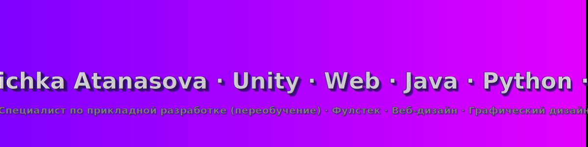

 

🌍 <strong>Доступно на:</strong>
&nbsp;&nbsp;|&nbsp;&nbsp;
&nbsp;&nbsp;|&nbsp;&nbsp;
&nbsp;&nbsp;|&nbsp;&nbsp;

---

ИТ‑специалист по разработке (переобучение) · Unity/C# · Веб (PHP/JS/SQL) · Фулстек · Графический дизайн · Штутгарт

## 🧭 Обзор
- Переобучение: ИТ‑специалист по разработке приложений (IHK Штутгарт)
- Фокус: разработка игр на Unity, веб‑разработка (PHP, JavaScript, SQL)
- Языки и инструменты: C#, Java, Python, PHP, JavaScript, SQL
- Подход: чистый код, TDD, прагматичность, ориентированность на пользователя

## 📚 Содержание

	
<em>Показать/скрыть</em>

<table style="border-collapse:collapse;margin:0;width:100%;table-layout:auto;">
	<tr>
		<td align="left" style="padding:0 8px; vertical-align: top;">
		  <ul style="list-style:none; padding:0; margin:0; white-space:nowrap;">
		    <li>🧭 <a href="#overview-ru">Обзор</a></li>
		    <li>🎯 <a href="#focus-ru">Фокус</a></li>
		    <li>📸 <a href="#screenshots-ru">Скриншоты</a></li>
		    <li>🛠️ <a href="#techstack-ru">Технологии</a></li>
		  </ul>
		</td>
		<td align="left" style="padding:0 8px; vertical-align: top;">
		  <ul style="list-style:none; padding:0; margin:0; white-space:nowrap;">
		    <li>🚀 <a href="#projects-ru">Проекты (выбор)</a>
		      <ul style="list-style:none; padding-left:0.75rem; margin:6px 0 0 0; white-space:nowrap;">
		        <li>🎮 <a href="#arcadia-ru">Проект Arcadia</a></li>
		        <li>🎵 <a href="#lyritune-ru">LyriTune</a></li>
		        <li>📚 <a href="#skillforge-ru">SkillForge</a></li>
		        <li>⏱️ <a href="#zeiterfassung-ru">Учет времени</a></li>
		      </ul>
		    </li>
		  </ul>
		</td>
		<td align="left" style="padding:0 8px; vertical-align: top;">
		  <ul style="list-style:none; padding:0; margin:0; white-space:nowrap;">
		    <li>🎨 <a href="#design-ru">Графический дизайн – Галерея</a></li>
		    <li>🌐 <a href="#webdesign-ru">Веб‑дизайн – Галерея</a></li>
		    <li>📜 <a href="#certificates-ru">Сертификаты</a></li>
		    <li>📈 <a href="#stats-ru">GitHub статистика</a></li>
		    <li>🤝 <a href="#contact-ru">Контакты</a></li>
		  </ul>
		</td>
	</tr>
 
 </table>

 

## 🎯 Фокус

 

 

## 🛠️ Технологии

 

 

## 🚀 Проекты (выбор)

<table>
    <tr>
  <td width="33%" align="center">
            
             
            <strong><a href="Labyrinth-Echo-of-the-Shards/">🎮 Project Arcadia</a></strong>&nbsp;
             
            Процедурные уровни, легкий ECS, акцент на ощущениях. 
            <em>Unity · C# · ScriptableObjects · Прототип</em> 
            
            
            
        </td>
  <td width="33%" align="center">
            
             
            <strong><a href="#lyritune-ru">🎵 LyriTune (Текст‑в‑мелодию)</a></strong> 
            Преобразует текст в мелодии; начальная аудио‑генерация. 
            <em>Python · Web (API/Frontend) · DSP · MVP</em> 
            
            
        </td>
  <td width="33%" align="center">
            
             
            <strong><a href="https://github.com/Velichka81/learn-platform">📚 SkillForge (платформа обучения)</a></strong> 
            Фокус AE, тесты и упражнения, чистый REST. 
            <em>PHP · JavaScript · SQL · REST</em> 
            
            
            
        </td>
    </tr>
</table>

<table>
    <tr>
  <td width="33%" align="center">
            
             
            <strong><a href="https://github.com/Velichka81/Zeiterfassung">⏱️ Учет времени</a></strong> 
            Простой и понятный инструмент для учета рабочего времени. 
            <em>PHP · JavaScript · SQL · REST</em> 
            
        </td>
    </tr>
</table>

### 🎮 Project Arcadia

Экспериментальный прототип Unity с процедурными уровнями, легким ECS и акцентом на «ощущении игры». Цель: чистая архитектура и быстрые итерации.

➡️ Unity‑проект: [Labyrinth – Echo of the Shards](Labyrinth-Echo-of-the-Shards/)

### 🎵 LyriTune (Текст‑в‑мелодию)

Преобразует короткие тексты в мелодии. Идёт работа над базовыми DSP‑модулями и небольшим веб‑API. Демонстрации и исходники будут добавлены позже.

### 📚 SkillForge (платформа обучения)

Обучающая платформа с уклоном на AE: модульная архитектура, движок викторин и чистые REST‑интерфейсы. Работаю над моделью данных и первыми endpoint‑ами.

➡️ Репозиторий: [SkillForge – Learn Platform](https://github.com/Velichka81/learn-platform)

### ⏱️ Учет времени

Инструмент для учета рабочего времени с простым интерфейсом. Цели: быстрый ввод, понятные отчеты и удобный экспорт.

➡️ Репозиторий: [Zeiterfassung](https://github.com/Velichka81/Zeiterfassung)

## 📸 Скриншоты

_Геймплей_

_UI_

_Панель_

_Панель_

## 🎨 Графический дизайн – Галерея

<table>
    <tr>
  <td align="center">
            
             Графический дизайн 1
        </td>
  <td align="center">
            
             Графический дизайн 2
        </td>
  <td align="center">
            
             Графический дизайн 3
        </td>
    </tr>
</table>

> Совет: Загляните также в подпроект в этом репозитории: `Labyrinth-Echo-of-the-Shards/`.

## 🌐 Веб‑дизайн – Галерея

<table>
    <tr>
  <td align="center">
            
             Веб‑дизайн 1
        </td>
  <td align="center">
            
             Веб‑дизайн 2
        </td>
  <td align="center">
            
             Веб‑дизайн 3
        </td>
    </tr>
</table>

## 📜 Сертификаты

- 🏆 Графический дизайнер (2022)
- 🖌️ Компьютерный график (2023)
- 💻 Веб‑дизайнер (2024)
- 👨‍💻 ИТ‑специалист по разработке приложений (с 2024, IHK Штутгарт)
- 🐍 Python основы и SQL (2025)
- 📈 Scrum (2025)

➡️ [Все сертификаты](https://github.com/Velichka81/certificates)

## 📈 GitHub статистика

## 🤝 Контакты

- 📫 Email: velichka811@abv.bg
- 💼 LinkedIn: https://www.linkedin.com/in/velichka-atanasova-32781a227
- 📍 Местоположение: Штутгарт, Германия

